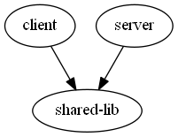
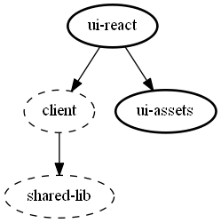
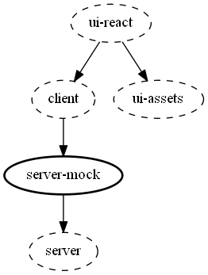
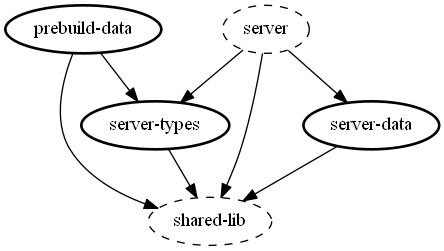

# Packages

The architecture supports several applications, e.g. client and server.

The following show build-time dependencies and `import` relationships,
i.e. the `client` and `server` packages both import the `shared-lib` package.

## Client, server, and shared

There's a `client`, a `server`, and a `shared-lib` which is a library of shared types and URLs.

The `client` and `server` would typically run on separate machines.

### [shared-lib](./shared-lib)

The `shared-lib` is imported by the client and the server.
It defines the data types and values which the two must share.

- [Data](./shared-lib/src/data) -- these are data types which are used when the rendering of the UI
  (for example `Discussion`, `User`, and `Tag`)
- [Messages](./shared-lib/src/messages) -- these are types used in the network protocol between the client and the
  server (they're an implementation detail of the client API and hidden from the UI)
- [URLs](./shared-lib/src/messages) -- these are URL formats, which correspond to "routes" in the client and "endpoints"
  in the REST API

### [client](./client)

The `client` is imported by the UI package on the client.

- [API](./client/src/api.ts) -- the HTTP GET and POST details, the construction of the URL, and some the network data
  formats, is abstracted/hidden from the UI by a client-side API

The `client` [reexports](./client/src/index.ts) data types from `shared-lib` which can be import by the UI -- so the
UI doesn't depend on `shared-lib` directly, and the client controls how much of the `\shared-lib` is hidden/abstracted
from the UI.

### [server](./server)

The `server` implements the end-points for the API used by the client.

- [Routes](./server/src/routes.ts) -- the `routeOnGet` and `routeOnPost` methods decode
  HTTP GET and POST requests, and handle/implement them by delegating to the corresponding database methods
- [Database](./server/src/database.ts) --
  - Stores the data.
  - Maintains indexes (i.e. various sort orders, often several indexes for a given data type).
  - Implements `get` methods to service the various HTTP GET requests
  - Implements one `handleAction` method to service the various HTTP PUT requests
- [Actions](./server/src/actions.ts) -- the HTTP PUT requests are encoded as types of action
  (server state changes could be implemented by a reducer)
- [Loader](./server/src/loader.ts) -- this loads data into the database on startup, from an external data store
  (loading is implemented as a chronological sequence of "put" actions, which replays how the data was first created)

## UI

### [ui-react](./ui-react)

The `ui-react` package uses React.js to implement the UI.

It imports and depends on the `client` package, which defines the data types, the URLs, and the API to the server.

See [this README](./ui-react#readme) for implementation details.

This is the only package which contains React-specific code and depends on the React package.

### [ui-assets](./ui-assets)

The `ui-react` package contains the icon files and CSS files used by the UI.

These are in this separate "assets" package so they can be maintained separately.

It is also possible in future to replace the `ui-react` with another implementations -- for example `ui-vue` --
which would reuse the `client` and the `ui-assets`.

## Mock server

### [server-mock](./server-mock)

The `server-mock` package lets the UI run as a standalone Single Page Application,
without a network connection to a remote server.

It implements a mock of the `fetch` API -- the client can be configured to GET or POST using the mock fetch instead
of using the browser's embedded fetch.

The mock fetch is implemented by delegating to the the `routeOnGet` and `routeOnPost` methods in the server package.
So the server implementation is imported as a dependency into the client application,
and runs inside the user's browser.

## Server data

### [server-data](./server-data)

The `server-data` package contains data loaded into the server on startup.

When the server is running in the browser as a result of `server-mock` it cannot use the file system to read data from
disk.
Instead the data in `server-data` is in JSON format, which the server's loader gets using `import` statements.

The database storage method could be changed in future,
e.g. to use a external database on the server and local storage in the client.

### [prebuild-data](./prebuild-data)

The `prebuild-data` package creates the JSON and other modules in the `server-data` package.

The `prebuild-data` package is built and run automatically when you run `yarn install`.

You could replace `prebuild-data` with another implementation --
as long as it creates the expected [JSON files](./server-data/json) in `server-data`.

### [server-types](./server-types)

The `prebuild-data` package must create `server-data` using a data format expected by the server.

The server's external data formats are therefore defined in this `server-types` package,
so that `prebuild-data` can import them before `server-data` is created
(therefore before the `server` package itself is buildable).
