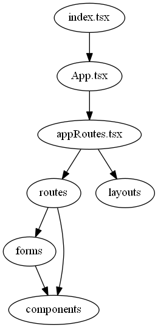

# React UI

This package implements the UI, using React and React Router.
This is the only package which depends on React.

## Create React App

This project was bootstrapped with [Create React App](https://github.com/facebook/create-react-app) ("CRA").

See also the [CRA-README.md](./CRA-README.md) (renamed from `README.md`).
Instead of running the scripts defined in the package in this directory,
you probably want to run them using `lerna` and/or via the scripts defined in the package in the root directory.

## Internal architecture

The software in this package is layered -- each layer in a separate directory.

The following shows build-time dependencies and `import` relationships.
As shown, the dependencies are acyclic -- higher layers depend on lower layers, and not vice versa.



### [index.tsx](./src/index.tsx) and [index.html](./public/index.html)

These files are standard boilerplate, created by CRA.

### [App.tsx](./src/App.tsx)

This module uses React Router to delegate to React elements in the `AppRoutes.tsx` module.

It uses an `Url` method (imported from the `client` API package) to parse the `locattion` from the React Router.

It also establishes the `AppContext` values, which can be read or called by subroutines deeper in the application.

This is the only module which depends on React Router, i.e. which imports `react-router-dom`.

### [appRoutes.tsx](./src/appRoutes.tsx)

This module contains React elements which render the page for any given route (a separate element for each route).

Almost every element in this module has a similar structure:

1. Use `useMemo` to memoize the parameters -- so that if the page is re-rendered with the same URL parameters,
   this will not force a re-fetch of the data from the server
2. Use `useFetchApi` to invoke an asynchronous API method defined in the client, to fetch data for this page from the
   server -- `useFetchApi` gets data via the `fetch` or `mockFetch` APIs.
3. Use `getPage` to render the page.

The `getPage` function wraps the following functionality that's common to ever page:

1. Tests whether the requested data has been received yet:
   - If not then display a "Loading..." message.
   - If so then use the received data to render the content on the page
2. Create a `Layout` structure with the rendered content elements,
   which identifies the type of page layout and where on the page each element belongs
3. Pass the `Layout` instance to the `renderLayout` function and return the result.

### [routes](./src/routes)

These modules contain functions which render the actual content of a page.

These functions are not called until after the data has been fetched.

These are functions, not React element -- they create React element which are the content of the page,
but these elements are returned within an application-specific `Layout` object.

These are the functions in which you can begin to see the application UI -- the modules above
these i.e. `App.tsx` and `apppRoutes.tsx` are boilerplate for parsing the routes and fetching data.

| What?                                                          | Who?                                         |
| -------------------------------------------------------------- | -------------------------------------------- |
| Use and parse the URL to switch to the appropriate route       | `App.tsx` using `Url`                        |
| Fetch the data for this Url (i.e. route) and query parameters  | `appRoutes.tsx` using `useFetchApi.tsx`      |
| Render the data                                                | `routes/*.tsx`                               |
| Show the rendered data within one the application page layouts | `appRoutes.tsx` using `getPage` and `layout` |

### [layout](./src/layout)

The web site has three or four different templates or layouts for a page.
Every page (or "route") uses one of these layouts.

To implement this, every page places its rendered content within a [Layout](./src/layout/Layout) interface,
which is finally passed to a `renderLayout` which returns the content within the selected template.

### [forms](./src/forms)

Some pages contain forms -- i.e. input elements and a submit button.

Forms are a type of component.
All modules in the forms directory have a similar structure:

1. Create a map which defines, for each input element, the name and type of the element,
   its attributes, validation options, and label
2. Call the `useValidatedInput` method, which creates and returns a map of the React elements for each input element,
   attaches a validation rule to each input, and may display a validation error message
3. Define a `handleSumbit` function to specify what happens when the Submit button is pressed
4. Returns a React element which contains the validated input elements and the Submit button.

### [components](./src/components)

These are React elements, which usually consist of a few HTML elements, have some associated CSS,
and are reused in more than one page.

Most of them are simple, some are more interesting.

The most complex is the element for selecting tags, which is described in its own README --
see [EDITORTAGS.md](./src/components/EDITORTAGS.md)

### [hooks](./src/hooks)

React hooks are not shown on the diagram above.

Almost all hooks are extracted/isolated into user-defined hooks in the [hooks](./src/hooks) directory -- the exceptions are:

- `useMemo` in the various `routes` modules
- A simple `useState` in the `NewDiscussion` component, which is used as a callback
  to receive state change notifications from a child component

The hooks are extracted into explicit user-defined hooks in the `hooks` directory, because:

- They're relatively tricky and deserve to be inspected specially in a code review
- Other components might be relatively easy to port to another framework like Vue,
  but porting hooks require some special care

The hook definitions are `*.ts` not `*.tsx` files -- they contain no inline React elements.

Some hooks import components, and some components import hooks -- so there's a risk of creating
cyclic dependencies.
To help avoid this risk, hook implementations do not import from the `components/index.ts` barrel file --
instead they import specific modules in the components folder.

## Dependencies

### `react-router-dom`

I made an effort to minimise the dependency on `react-router-dom`,
so that I might in future reimplement the application using a different framework (for example Next.js).

The only source file which imports `react-router-dom` is `App.tsx` -- so in theory I could create a different
project with a different `App.tsx`, using a different framework, which would reuse the reset of the source code.

Functionality that's implemented by React Router and needed deep in the rendering or behaviour of components --
which includes, rendering `<Link>` elements, and simulating the pushing of a new URL into Browser history --
are made available to or pushed into the application via the `AppContext`.

### `fetch` and `useState`

Similarly I made an effort to minimise the dependency on the `fetch` and `useState` methods
(which fetch data from the server and store the data as state within the client),
so in future I might reimplement the application using a different framework (for example Apollo GraphQL).

The the `fetch` and `useState` methods are wrapped in a single user-defined hook function (i.e. `useFetchApi.ts`) --
and the React elements which use this hook (a separate element for each page or route) are all in one source file
(i.e. `appRoutes.tsx`).

So in theory I could create a different project with a different `appRoutes.tsx`, to use a different state management
and/or data fetching framework.

## Integration with Express and Heroku

I did the minimum necessary to integrate with express:

- Create a `server.js` which serves what is in the `build` directory
- Add a new script named `express` to `package.json`
- Added a script named `heroku-postbuild` (which runs the existing `prebuild-data` script)

The express server can therefore be started by running the following scripts:

```
yarn build
yarn express
```

I also defined a `Procfile` -- see Heroku's
[Specifying a start script](https://devcenter.heroku.com/articles/deploying-nodejs#specifying-a-start-script).

## Several build targets

The client can be built in different ways, using different build scripts in the `package.json`.

### `build:client`

This builds the client without including the [`mock-server`](../#mock-server) module.

The client uses the browser's `fetch` API to communicate with the server, and requires the separate server to be running.

### `build:mock`

This builds the client with the [`mock-server`](../#mock-server) module injected into its client API.

The client and server therefore run as a monolithic SPA within the browser -- without a separate server process
(except for either the WebPack development server which is used with the `start:mock` script,
or the simple version of the express server which is used with the `express` script).

This version is convenient to debug --
because client and server are both running in the same process (i.e. in the browser),
and because the whole thing is reloaded automatically if you edit client-side or server-side source code.

### `build:docs`

This is like `build:mock` except that the `PUBLIC_URL` environment variable is set to `/view`,
and except that the build is copied into the `../../docs` directory.

This is the SPA which is used to demonstrate this project as a GitHub page,
hosted at https://cwellsx.github.io/view/

### How the builds are implemented

This package's build is based on Create React App (CRA), which is designed to be not very configurable.

Still I'm using four mechanisms to configure it:

- Using `react-app-rewired` and `config-overrides.js` to make it build several packages in a monorepo
  -- for details see
  [Better integration with Create React App](../../MONOREPO.md#better-integration-with-create-react-app)
- There are two versions of `index.tsx` -- named `index-client.tsx` and `index-mock.tsx` -- one of these imports and uses
  the `mock-server` package and the other one doesn't.
  I tried to reference them using `paths` in the `config-overrides.js` but that was only partially
  successful, so instead I copy one or the other to `index.tsx` which is the filename which CRA is expecting.
- Environment variables are defined in files named `.env.client`, `.env.mock`, and `.env.docs`,
  which are activated for a given build by the `end-cmd` tool.
- After the build the build directory (named `build`) is renamed.
